# Procesverslag
---

## Ik
<details open>
  <summary>uitwerken voor kick-off werkgroep</summary>

  ###

  |Auteur✍🏽|Starniveau🏔️|Focus🤔|
  |---|---|---|
  |Vincent Pinas|Zwart+|Helemaal responsive en functionaliteiten|
 
</details>


## Je website

<details open>
  <summary>uitwerken voor kick-off werkgroep</summary>

  ### Je opdracht:
  voor deze opdracht ga ik een aantal pagina's van de [**Nasa website**](https://www.nasa.gov/) namaken.
  

  #### Screenshot(s) van de eerste pagina (small screen): 
  [Home screen](https://www.nasa.gov/)

  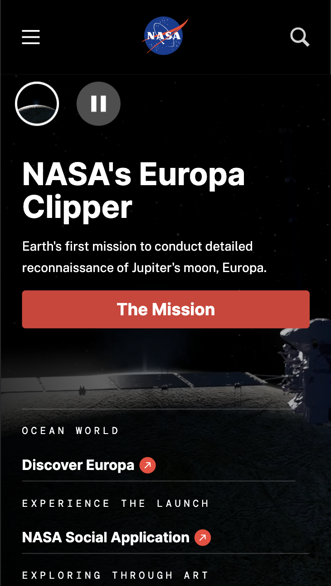
  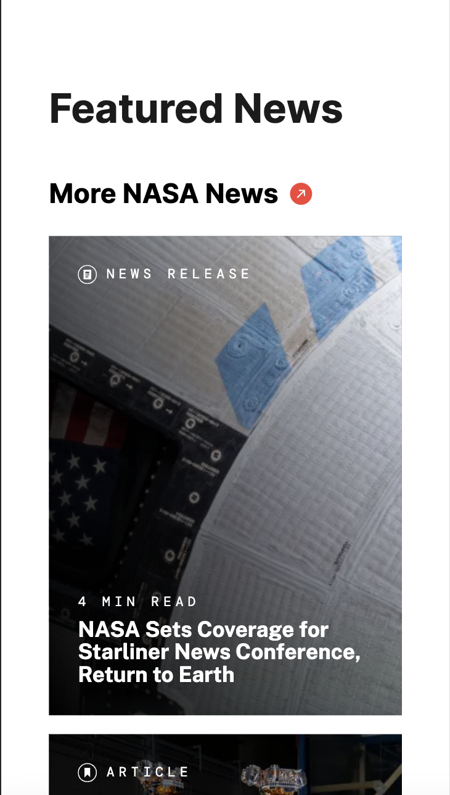

  #### Screenshot(s) van de tweede pagina (small screen):
  [Missions screen](https://www.nasa.gov/missions/)

  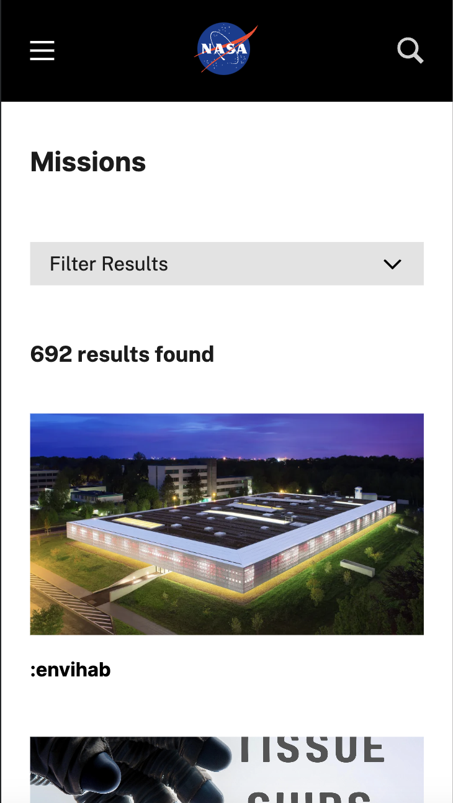
  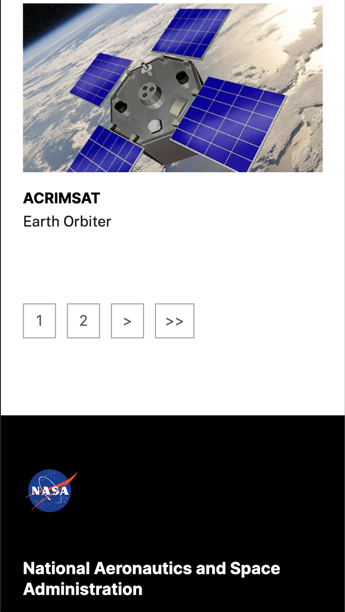
 
</details>


## Toegankelijkheidstest 1/2 (week 1)

<details>
  <summary>uitwerken na test in 2<sup>e</sup> werkgroep</summary>

  ### Bevindingen
  Lijst met je bevindingen die in de test naar voren kwamen:

  - Heel veel errors in HTML validator
  - Niet elke knop is groot genoeg voor op mobiel
  - Er worden heading levels geskipped en er is helemaal geen h1
  - Er is een auto-play video, maar zonder flitsende beelden of geluid en met de optie om hem te pauzeren.
  - links die naar andere sites leiden lijken op normale links
  - Geen hoge contrast modus, in iedergeval niet gemerkt
  - Geen light of dark mode alleen normale kleuren
  - Geen prefers reduced motion query, maar ook vrijwel geen animaties gevonden.
  - Icoontjes over sommige afbeeldingen zijn niet heel goed te zien
  
</details>


## Breakdownschets (week 1)

<details>
  <summary>uitwerken na afloop 3<sup>e</sup> werkgroep</summary>

  ### de hele pagina: 
  

  ### dynamisch deel: 
  

</details>


## Voortgang 1 (week 2)

<details>
  <summary>uitwerken voor 1<sup>e</sup> voortgang</summary>

  ### Stand van zaken
  Ik ben rustig begonnen met de structuur van de HTML te maken en hele basic css.
  De originele site gebruikte alleen maar div's dus ik moest de hele structuur zelf bedenken, maar ik heb al vaak development werk gedaan, dus dit was geen probleem.

  
  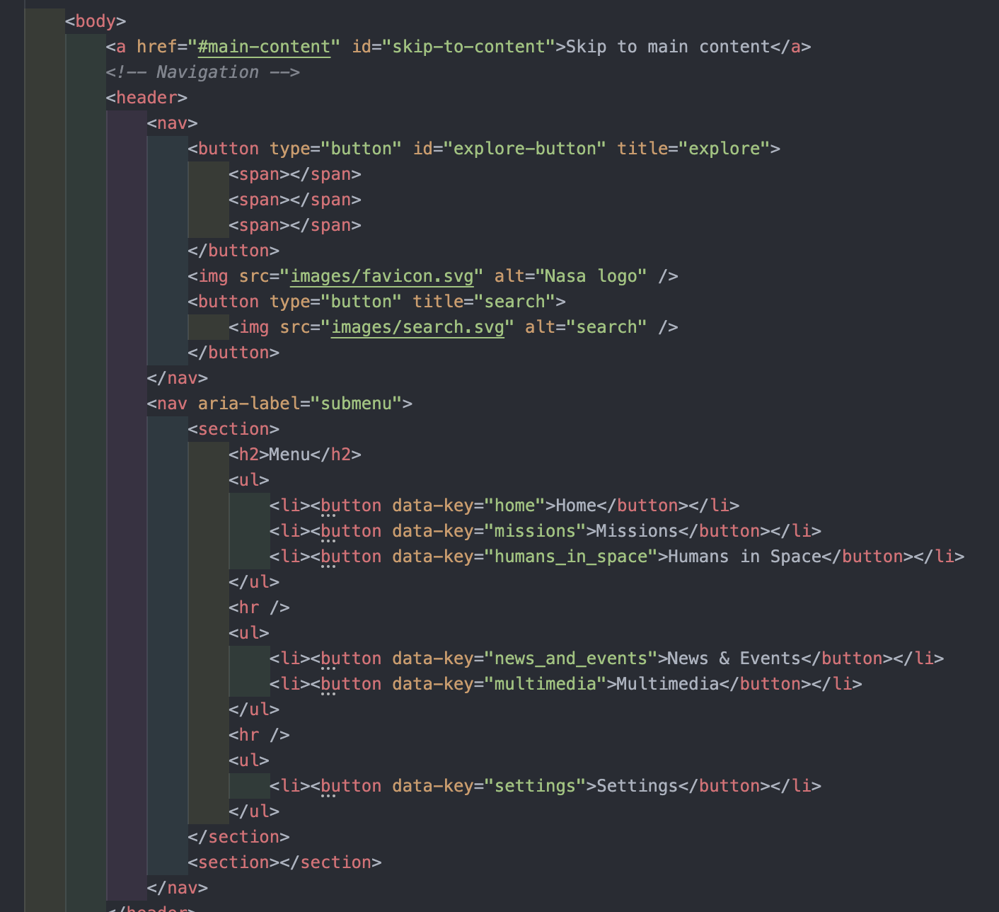
  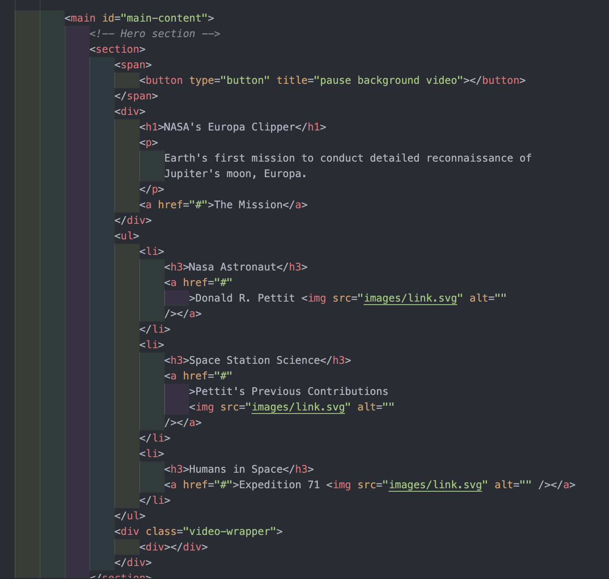


  ### Agenda voor meeting
  samen met je groepje opstellen

  | Vincent        | student 2          | student 3    | student 4        |
  | ---            | ---                | ---          | ---              |
  |   | en dit             | en ik dit    | en dan ik dat    |
  | en dat ook nog | dit als er tijd is | nog een punt | dit wil ik zeker |
  | ...            | ...                | ...          | ...              |


  ### Verslag van meeting
  hier na afloop snel de uitkomsten van de meeting vastleggen

  - Skip to content knop toevoegen voor screenreaders
  - Je kan verder ingaan op accessibility met bijv. aria-labels als er extra tijd voor over is
  - Er is niet echt een minimaal of maximaal voor functionaliteiten toevoegen, gewoon zoveel als je kan.

</details>


## Voortgang 2 (week 3)

<details>
  <summary>uitwerken voor 2<sup>e</sup> voortgang</summary>

  ### Stand van zaken
  Deze week ben ik begonnen met alles stijl te geven waarna ik kreeg te horen dat omdat ik al eerder development werk heb gedaan dat ik niet de hele site hoefte na te maken, maar meer met accessibility, functionaliteiten en nieuwe CSS Features kan werken.
  Hierna heb ik een klein deel van wat ik origineel zou namaken compleet gestyled zoals het er op de NASA website zou uitzien.

  Voor mijn eerste taak met deeze nieuwe opdracht ben ik aan een scroll animatie volledig in CSS gaan werken. Dit was even wennen, omdat ik de tutorial had gelezen, maar precies hoe de functies werkte snapte ik eerst niet dus ik kon het niet werkend krijgen. Uiteindelijk bleek het dat ik "nearest" in de scroll functie moest gebruiken, omdat hij dan de dichtsbijzeinde parent met een scrollbar pakt en hoe ik het eerst probeerde te doen was het op het element zelf die geen scrollbar had.

  Hierna ben ik gaan werken aan het menu en ben zover gekomen als het basic menu af te krijgen en ik ga nu het tweede deel afmaken van het slide out menu
  waarom dynamisch elementen worden aangemaakt.
  En omdat het menu nu werkte heb ik ook een skip content knop gemaakt zoals in de feedback van vorige week stond.

  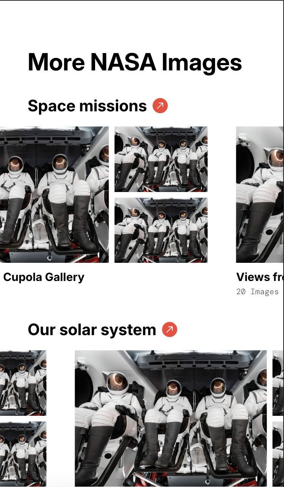
  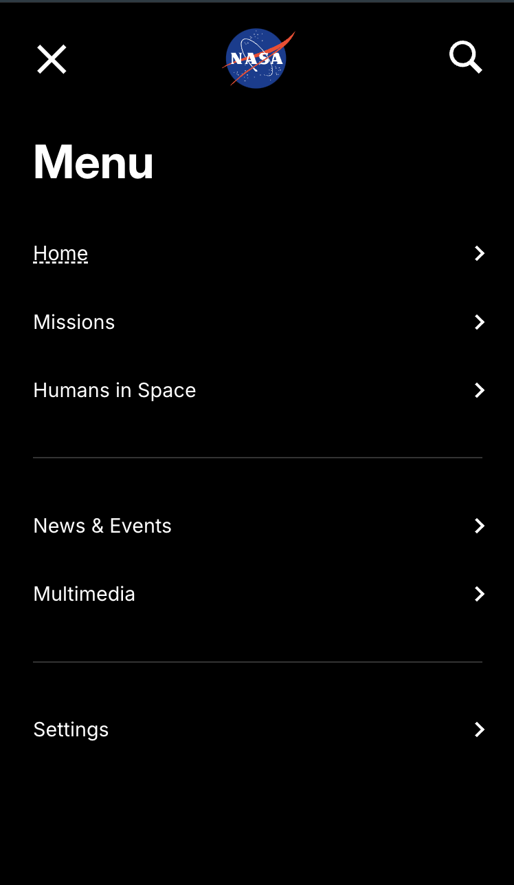
  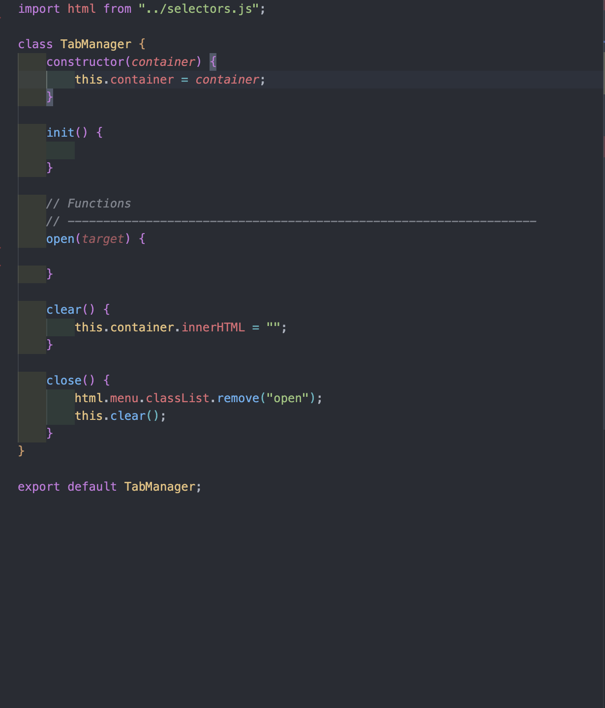
  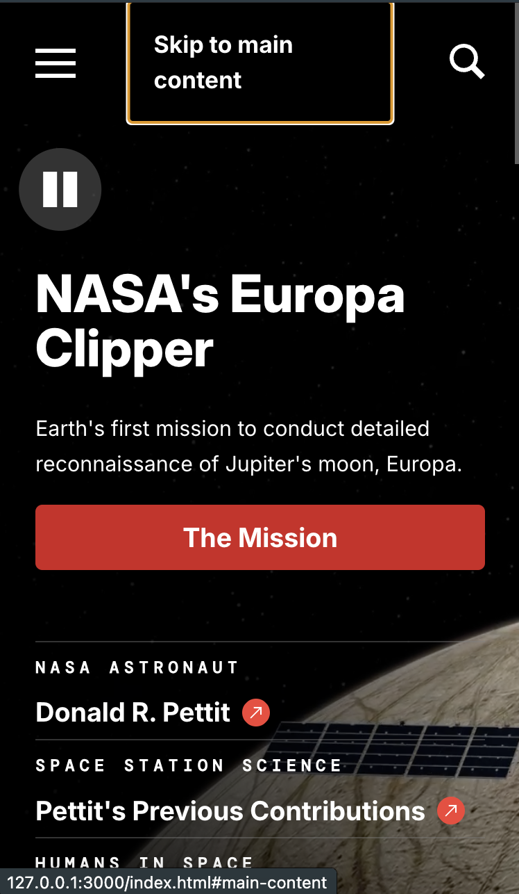


  ### Agenda voor meeting
  samen met je groepje opstellen

  | student 1      | student 2          | student 3    | student 4        |
  | ---            | ---                | ---          | ---              |
  | dit bespreken  | en dit             | en ik dit    | en dan ik dat    |
  | en dat ook nog | dit als er tijd is | nog een punt | dit wil ik zeker |
  | ...            | ...                | ...          | ...              |


  ### Verslag van meeting
  hier na afloop snel de uitkomsten van de meeting vastleggen

  - punt 1
  - punt 2
  - nog een punt
- ...

</details>


## Toegankelijkheidstest 2/2 (week 4)

<details>
  <summary>uitwerken na test in 9<sup>e</sup> werkgroep</summary>

  ### Bevindingen
  Lijst met je bevindingen die in de test naar voren kwamen (geef ook aan wat er verbeterd is):
  - HTML Validatie geeft nu geen errors meer
  - Na hamburger icoon groter te maken zijn buton sizes groot genoeg om makkelijk aan te klikken
  - Eerst was er geen h1, nu wel
  - Er wordt nog een heading level geskipped in de code 1x dus dat wordt zo snel mogelijk opgelost
  - De background video heeft nog autoplay en kan nog niet gepauseerd worden dus dat wordt nog opgelost
  - Light en dark mode zijn nu beschikbaar
  - Er moet nog een prefers-reduced-motion query komen

  ### Bevindingen screen-reader test
  - **Probleem:** Als je in het menu tab klikt dan gaat hij verder in de body daarna en kan je het menu niet meer uit
  **Oplossing:** Als het menu actief is, moet de body niet meer focusable zijn tot het menu niet meer actief is, daarom: ```body:has(header.active) main {
	display: none;
}```

</details>


## Voortgang 3 (week 4)

<details>
  <summary>uitwerken voor 3<sup>e</sup> voortgang</summary>

  ### Stand van zaken
  Deze week heb ik beide het menu helemaal uitgewerkt, het settings tabblad voor een groot deel af en de bevindingen uit de testen van vorige week opgelost.

  Er waren nu wel wat dingen waar ik tegen aan liep, maar ik kon ze opzich wel snel oplossen.
  Eerste probleem was hoe ik de elementen ging maken voor elk tab in het nieuwe menu. Ik had in de html al keys aan de knoppen in het menu gegeven, dus nu ik heb gekozen om een object te maken met alle data van de elementen die ik wil maken per tab. Op die manier kan ik elk elementen maken dat ik wil zonder al te veel code te schrijven door in 1 loop gewoon elk element te maken met de tata uit het object.

  hierna moest ik alleen nog een functie maken om in de loop te gebruiken zodat elk html element juist aangemaakt wordt.

  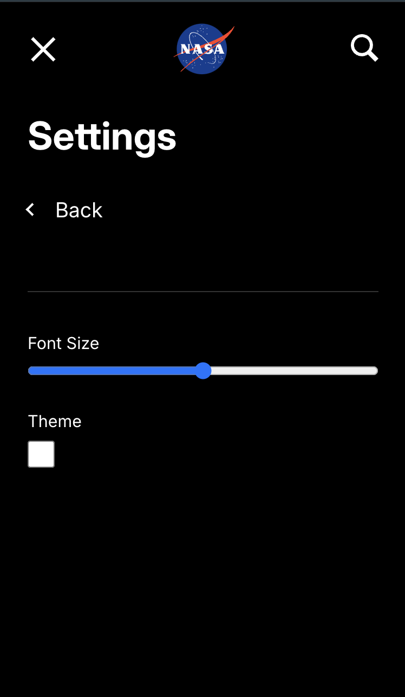
  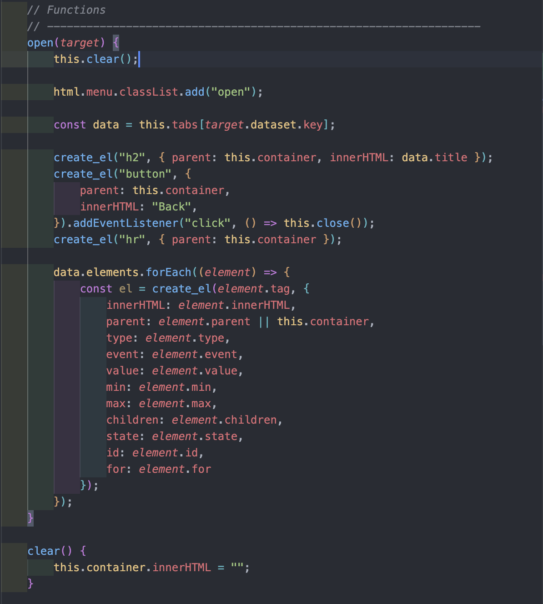
  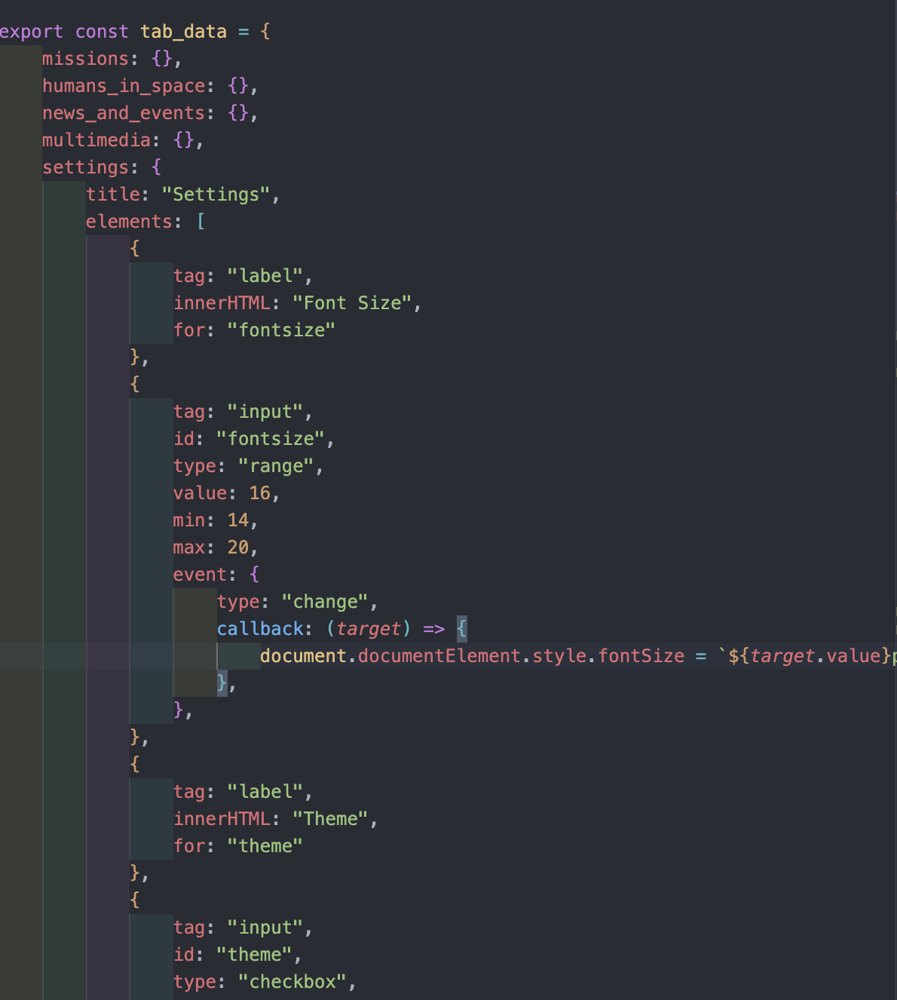
  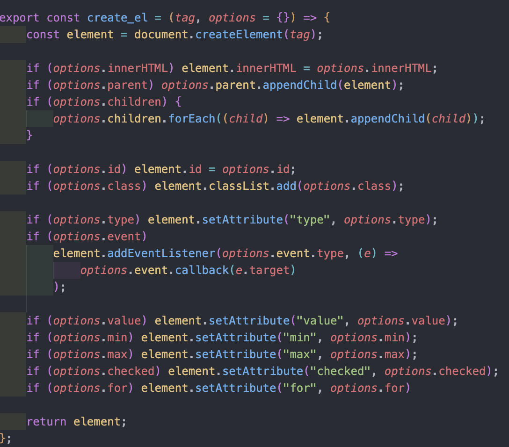


  ### Agenda voor meeting
  samen met je groepje opstellen

  | student 1      | student 2          | student 3    | student 4        |
  | ---            | ---                | ---          | ---              |
  | dit bespreken  | en dit             | en ik dit    | en dan ik dat    |
  | en dat ook nog | dit als er tijd is | nog een punt | dit wil ik zeker |
  | ...            | ...                | ...          | ...              |


  ### Verslag van meeting
  hier na afloop snel de uitkomsten van de meeting vastleggen

  - Readme verbeteren
  - Beoordelings formulier bekijken
  - Clamp bekijken voor font size responsiveness

</details>


## Eindgesprek (week 5)

<details>
  <summary>uitwerken voor eindgesprek</summary>

  ### Je uitkomst - karakteristiek screenshots:
  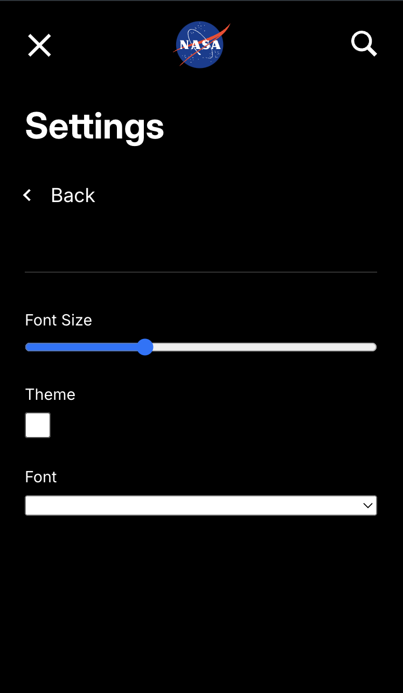
  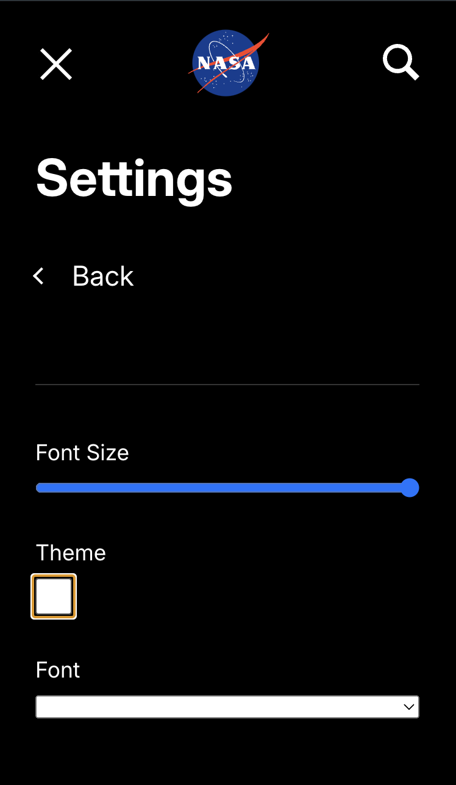
  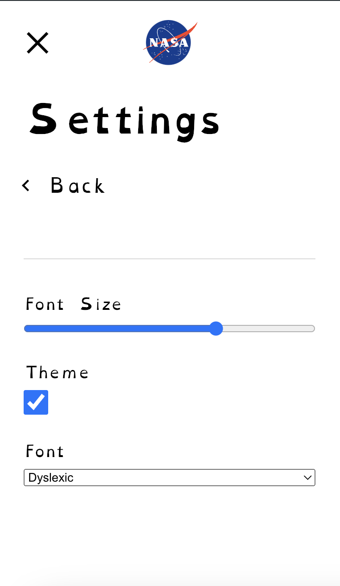
  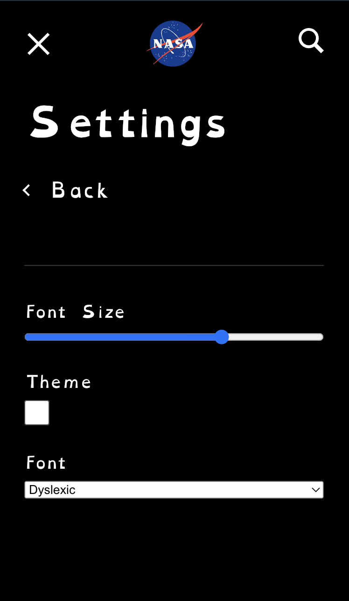
  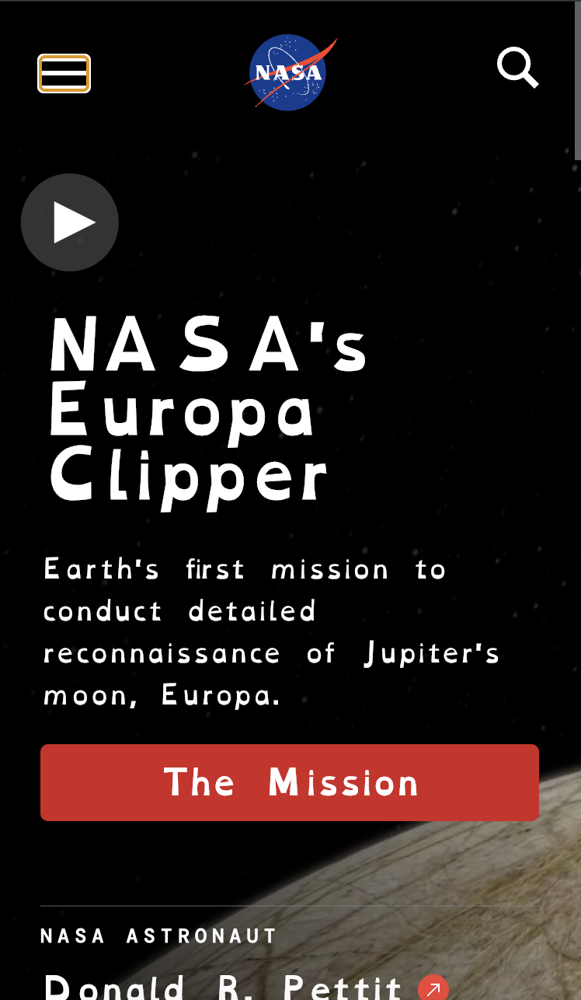

  ### Dit ging goed/Heb ik geleerd: 
  Ik heb geleerd hoe je voice over kan gebruiken en hoe je hier ook meer rekening mee houd.
  Ik heb geleerd hoe je css scroll animaties kan maken, hoe je de ```:has()``` property goed kan gebruiken in combinatie met andere selectors om makkelijker een element te kunnen selecteren. Ook heb ik geleerd hoe je een dark theme kan maken zonder uberhaupt nog JavaScript. Als laatste van de css tricks om de prefers-reduced-motion query te gebruiken.
  Ik heb een nieuwe manier geleerd om elementen dynamisch aan te maken als dat een keer nodig is in een ander project.

  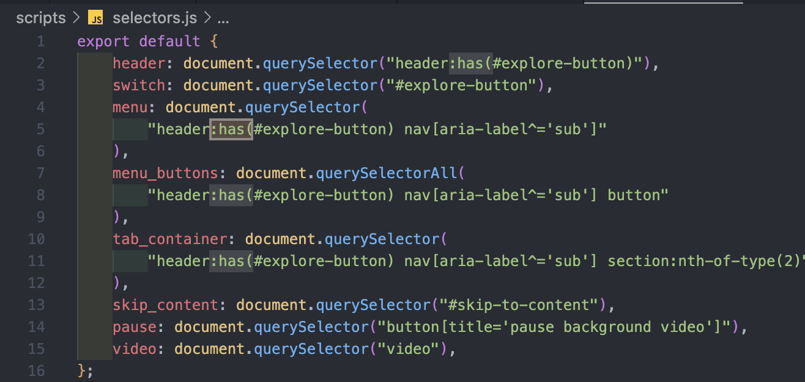
  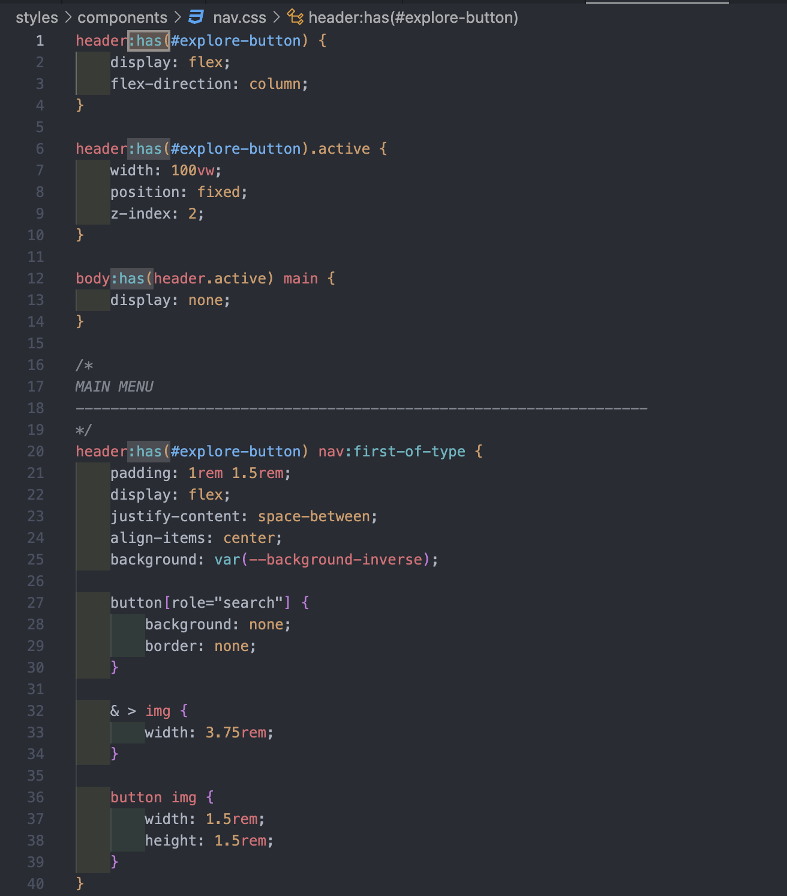
  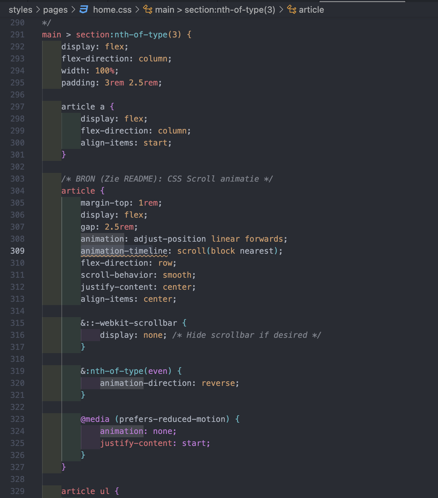
  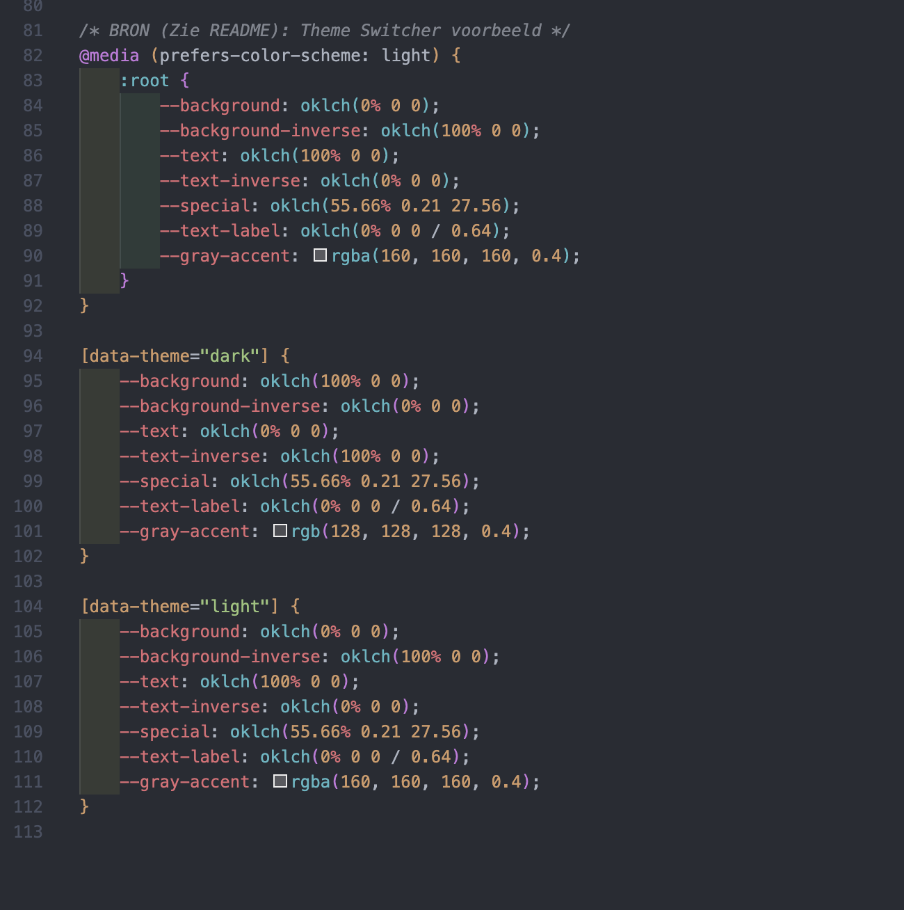
  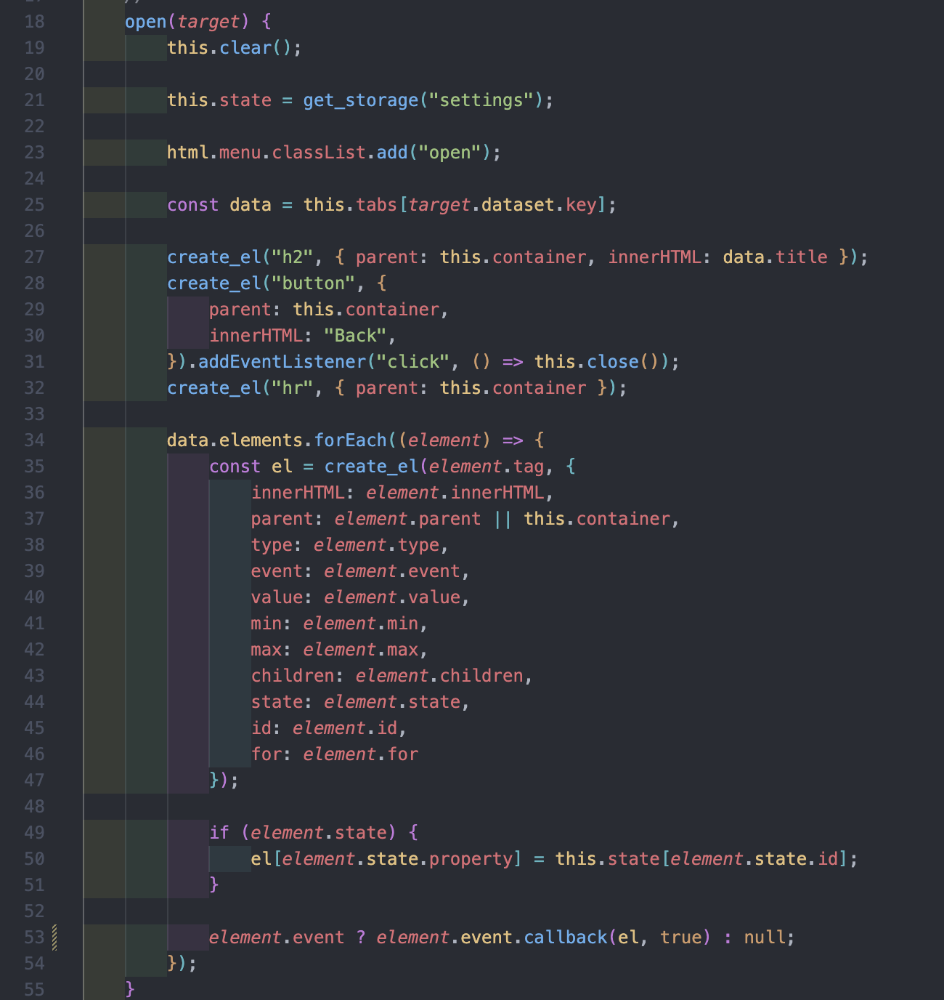


  ### Dit was lastig/Is niet gelukt:
  Ik wou nog meer opties aan het settings menu toevoegen zoals andere talen en andere features.
  Ik wou ook nog de state management met localStorage verbeteren, maar helaas heb ik te weinig tijd.
</details>


## Bronnenlijst

<details open>
  <summary>continu bijhouden terwijl je werkt</summary>

  Nb. Wees specifiek ('css-tricks' als bron is bijv. niet specifiek genoeg). 
  Nb. ChatGpT en andere AI horen er ook bij.
  Nb. Vermeld de bronnen ook in je code.

  1. [aria-label & aria-labelledby info voor in de html](https://stackoverflow.com/questions/26032089/in-html-how-can-i-have-text-that-is-only-accessible-for-screen-readers-i-e-fo)
  2. [CSS Scroll animatie](https://scroll-driven-animations.style/demos/reverse-scroll/css/)
  3. [Theme switcher voorbeeld](https://codepen.io/saadeghi/pen/OJypbNM)

</details>